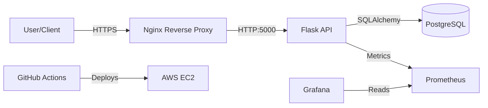

# 🎯 Task Manager API

A production-ready REST API built with Flask, Docker, and Terraform, designed to demonstrate **DevSecOps** best practices. This project includes a full CI/CD pipeline, infrastructure as code, and observability.

## 🏗️ Architecture



## 🛠️ Tech Stack

*   **Backend**: Python, Flask, SQLAlchemy
*   **Database**: PostgreSQL (Prod), SQLite (Dev)
*   **Containerization**: Docker, Docker Compose (Multi-stage builds)
*   **CI/CD**: GitHub Actions (Testing, Security Scanning, Auto-Deployment)
*   **Infrastructure as Code**: Terraform (AWS EC2, Security Groups)
*   **Security**: Bandit (SAST), Trivy (Container Scan), Nginx (Reverse Proxy)
*   **Observability**: Prometheus, Grafana, Structured Logging

## 🚀 Getting Started

### Prerequisites
*   Docker & Docker Compose
*   Git

### Local Development
1.  **Clone the repository**:
    ```bash
    git clone https://github.com/Rexien/task-manager-api.git
    cd task-manager-api
    ```

2.  **Start Services**:
    ```bash
    docker-compose up --build
    ```

3.  **Access the App**:
    *   API Health: `http://localhost/health`
    *   Grafana: `http://localhost:3000` (User/Pass: `admin`)
    *   Prometheus: `http://localhost:9090`

## 🔌 API Usage

**Authentication**: Add header `X-API-Key: dev-key` (default for local).

| Method | Endpoint | Description |
| :--- | :--- | :--- |
| `GET` | `/api/v1/tasks` | Get all tasks |
| `POST` | `/api/v1/tasks` | Create a task |
| `PUT` | `/api/v1/tasks/<id>` | Update a task |
| `DELETE` | `/api/v1/tasks/<id>` | Delete a task |

**Example - Create Task**:
```bash
curl -X POST http://localhost/api/v1/tasks \
  -H "X-API-Key: dev-key" \
  -H "Content-Type: application/json" \
  -d '{"title": "Learn DevSecOps", "status": "in-progress"}'
```

## ⚙️ Environment Variables

Copy `.env.example` to `.env` and adjust:

| Variable | Description | Default |
| :--- | :--- | :--- |
| `DATABASE_URL` | DB Connection String | `postgresql://...` |
| `API_KEY` | Secret for API Auth | `dev-key` |
| `LOG_LEVEL` | Logging verbosity | `INFO` |

## 📦 Deployment (CI/CD)

The project uses **GitHub Actions** for:
1.  **Tests**: Runs `pytest`.
2.  **Security**: Runs `bandit` (Python) and `trivy` (Docker).
3.  **Infrastructure**: runs `terraform apply` to provision AWS resources.
4.  **Deployment**: Updates the EC2 instance with the latest code.

## 📊 Monitoring

The application exposes metrics at `/metrics`.
*   **Prometheus** scrapes these every 15s.
*   **Grafana** dashboards can be built to track request latency, error rates, and task counts.
